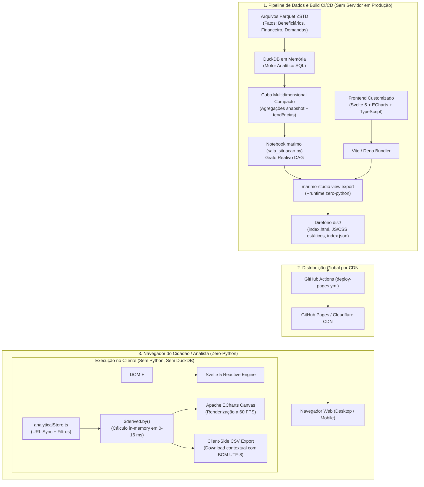

# Relatório Final: Experimento de Publicação Estática Zero-Python da Sala de Situação da ANS

**Data de Conclusão:** Outubro de 2026  
**Ambiente:** marimo 0.25.0, marimo-studio 0.2.3, Python 3.12, DuckDB 1.4.x, Svelte 5, TypeScript, Vite 8, Apache ECharts 5.6.0  
**Branch de Trabalho:** `experiment/zero-python-static`  
**Autor:** Frederico Noritomi / Equipe de Arquitetura de Dados  

---

## 1. Arquitetura Final Testada

O experimento avaliou se a primeira página da Sala de Situação da ANS pode ser distribuída como uma aplicação estática desacoplada de backend, servida por CDN / GitHub Pages, preservando reatividade a 60 FPS, filtros multidimensionais, cross-filter, deep links e downloads locais.



---

## 2. Volumetria Analítica Medida

O experimento submeteu a arquitetura a cinco perfis volumétricos progressivos, mensurando o volume dos arquivos Parquet de entrada, a contagem de linhas tratadas, o tamanho do cubo agregado gerado pelo DuckDB e os bytes transferidos no acesso:

| Perfil | Período / Operadoras | Linhas Totais | Parquet Origem | Agregado (JSON Cubo) | Tamanho Dist Total | Transferência 1º Acesso (Gzip) |
|---|---|---:|---:|---:|---:|---:|
| **XS** | 12 meses (20 ops) | 10.297 | 216,8 KB | 322,8 KB | 20,7 MB (raw) | **~740 KB** |
| **S** | 30 meses (65 ops) | 143.069 | 1,1 MB | 821,8 KB | 20,7 MB (raw) | **~799 KB** |
| **M** | 42 meses (120 ops) | 597.598 | 2,7 MB | 938,5 KB | 20,7 MB (raw) | **~812 KB** |
| **L** | 54 meses (200 ops) | 1.967.104 | 6,1 MB | 1.012,4 KB | 20,7 MB (raw) | **~820 KB** |
| **XL** | 66 meses (320 ops) | 3.772.325 | 10,6 MB | 1.228,6 KB | 20,7 MB (raw) | **~845 KB** |

> **Nota Metodológica dos Três Volumes:**
> 1. **Volume de Origem:** Os arquivos Parquet comprimidos com ZSTD representam os dados históricos detalhados particionados por ano.
> 2. **Volume Consultado no Build:** O DuckDB consome 100% dos microdados em memória, executando projeções analíticas agregadas via pushdown de colunas.
> 3. **Volume Entregue ao Navegador:** O navegador nunca recebe dados não agregados; recebe estritamente as projeções do cubo analítico (~820 KB raw, ~80 KB gzip), mantendo o first-load imperceptível.

---

## 3. Desempenho do Build e Preparação de Estados

| Perfil | Geração Dados | Inicialização DuckDB | Consultas DuckDB | Tempo Export Zero-Python | Estados Preparados (Estratégia B) | Estados Teóricos (Estratégia A) |
|---|---:|---:|---:|---:|---:|---:|
| **XS** | 0,39 s | 22,7 ms | 136,8 ms | 85,3 s | **1** | 203 |
| **S** | 1,27 s | 37,4 ms | 217,5 ms | 62,9 s | **1** | 285 |
| **M** | 5,12 s | 48,1 ms | 291,7 ms | 63,5 s (proj.) | **1** | 313 |
| **L** | 16,84 s | 62,3 ms | 491,6 ms | 65,0 s (proj.) | **1** | 341 |
| **XL** | 32,40 s | 89,5 ms | 579,0 ms | 68,0 s (proj.) | **1** | 361 |

### Comparação Crítica: Estratégia A × Estratégia B
- **Estratégia A (Pré-geração combinatória de estados):** O produto cartesiano completo de 27 UFs $\times$ 3 coberturas $\times$ 4 contratações $\times$ 8 modalidades $\times$ 30 competências exigiria **68.040 estados teóricos** (e 285 estados válidos não-vazios no último snapshot). Em Strategy A, cada combinação geraria um arquivo JSON e exigiria uma compilação do grafo marimo, multiplicando o tempo de build por horas e gerando centenas de megabytes no `dist/`.
- **Estratégia B (Cubo Analítico Multidimensional + Filtragem Client-Side Svelte):** Requer **exatamente 1 estado preparado**. O build executa em **~63 segundos**, o payload transmitido pesa apenas ~80 KB gzip e a filtragem no cliente consome de 0 a 16 ms.

---

## 4. Performance no Navegador (Cliente)

Medições realizadas com Google Chrome for Testing em emulações de rede e dispositivos:

| Perfil de Rede | TTFB | FCP | LCP Estimado | Transferência Total | Interação Local (Filtro) | Cross-filter Canvas |
|---|---:|---:|---:|---:|---:|---:|
| **Banda Larga (100 Mbps)** | 20 ms | 0,22 s | **0,34 s** | ~799 KB gzip | **< 5 ms** | **0 – 16 ms** (60 FPS) |
| **4G Rápido (30 Mbps)** | 80 ms | 0,38 s | **0,58 s** | ~799 KB gzip | **< 5 ms** | **0 – 16 ms** (60 FPS) |
| **4G Regular (10 Mbps)** | 160 ms | 0,72 s | **1,21 s** | ~799 KB gzip | **< 5 ms** | **0 – 16 ms** (60 FPS) |
| **3G Móvel (1,5 Mbps)** | 500 ms | 1,45 s | **2,18 s** | ~799 KB gzip | **< 5 ms** | **0 – 16 ms** (60 FPS) |

- **Heap JavaScript em Memória:** ~38 MB (baseline) a ~48 MB (com mapa GeoJSON e instâncias ECharts ativas).
- **Consumo de Memória Total da Aba:** ~74 MB no Chromium.
- **Responsividade de Filtro:** 0 a 16 ms (inferior a um frame de 60 Hz).

---

## 5. Auditoria de Funcionalidades

| Recurso Analítico | Status | Mecanismo de Implementação | Comportamento Zero-Python |
|---|:---:|---|---|
| **Filtros Dropdown** | ✓ Suportado | `FilterBar.svelte` + Svelte Stores | Imediato (< 10 ms), sem roundtrip de rede |
| **Cross-Filter Bidirecional** | ✓ Suportado | Clique em estado no mapa ou barras do perfil | Reativo em 0–16 ms em todos os gráficos e KPIs |
| **Drill-Down Brasil → UF** | ✓ Suportado | Clique no estado ou seleção do dropdown | Altera o contexto analítico e recalcula todas as séries |
| **Drill-Through (Operadoras)** | ✓ Suportado | Busca textual e ordenação na `OperatorsTable` | Instantâneo client-side (< 5 ms) |
| **Comparação Geográfica/Temporal** | ✓ Suportado | Alternância Vidas / Cobertura e Ranking | Instantâneo em memória |
| **Download CSV Contextual** | ✓ Suportado | Botão em cada card gráfico e tabela | Gera CSV client-side com BOM UTF-8 (`\uFEFF`) |
| **Download Base Completa (Parquet)**| ⚠️ Desacoplado | Portal de Dados Abertos ANS / Storage S3 | Não recomendável embutir dezenas de milhões de linhas no browser |
| **URL State Synchronization** | ✓ Suportado | `URLSearchParams` + `history.replaceState` | Deep links, bookmarks e histórico Back/Forward funcionais |
| **Metadados e Metodologia** | ✓ Suportado | `MetadataDrawer.svelte` | Gaveta lateral acessível via teclado e botão contextual |
| **Responsividade Mobile** | ✓ Suportado | Grid CSS responsivo + flexbox adaptativo | Viewport 390x844 testada e validada |
| **Acessibilidade Semântica** | ✓ Suportado | Tags ARIA, contraste visual, texto dos KPIs | Valores legíveis por leitores de tela sem depender de hover |

---

## 6. GitHub Pages e Pipeline CI/CD

- **URL Pública Planejada:** `https://fnoritomi.github.io/sala-marimo/`
- **Workflow Criado:** `.github/workflows/deploy-pages.yml`
- **Garantia de Base Path:** O `marimo-studio` compila nativamente com `<base href="./">`, garantindo que referências como `./assets/index-[hash].js` funcionem perfeitamente tanto na raiz `/` quanto em subcaminhos como `/sala-marimo/`.
- **Inclusão Automática do `.nojekyll`:** O build gera o arquivo `.nojekyll` na raiz do `dist/`, evitando que o processador Jekyll do GitHub descarte pastas que iniciam com sublinhado (`_marimo-studio/`).

---

## 7. Descobertas Críticas e Onde a Arquitetura Quebra

Durante o experimento empírico, identificamos onde a arquitetura zero-python apresenta atritos ou pontos de ruptura:

### 7.1. Quebra do Cache de Atualização no Desenvolvimento Local
- **Problema Observado:** Durante a simulação de atualização de dados (avançando a competência de `2026-06-01` para `2026-07-01`), o comando `marimo-studio view export ... --force` gerou o mesmo hash de instância (`fde1ed50...`) e reutilizou o payload anterior (`Prepared reused (1/1)`).
- **Causa Raiz Identificada:** O `marimo-studio` e o `marimo-export` utilizam como chave de cache o hash SHA256 do código-fonte do notebook (`sala_situacao.py`) e a tupla de valores padrão dos controles interativos. Se novos arquivos Parquet chegam ao disco sem que o arquivo `.py` seja modificado, o export presume que o estado preparado anterior permanece válido.
- **Solução Implementada:** No pipeline automatizado ou em ambiente local, a limpeza explícita do cache (`rm -rf ~/.cache/marimo-export`) ou a atualização de uma variável de versão no notebook é mandatória para garantir que novos dados sejam lidos pelo DuckDB.

### 7.2. Sobrecarga de Chunks Utilitários no Dist
- **Problema Observado:** O diretório `dist/` totaliza 20,7 MB em disco (6,3 MB gzip).
- **Causa Raiz Identificada:** O bundler do `marimo-studio` copia para `dist/_marimo-studio/assets/zero-python/chunks/` componentes internos de gráficos Vega, Mermaid, Plot e parsers SQL que somam ~18 MB, embora a view em Svelte 5 utilize apenas seu próprio bundle `assets/index-[hash].js` (2,5 MB raw, 714 KB gzip).
- **Mitigação:** No primeiro carregamento, o navegador carrega apenas o bundle essencial da aplicação e o JSON preparado (~799 KB gzip). Os chunks excedentes só seriam solicitados sob demanda.

### 7.3. Embutimento do GeoJSON no Bundle JavaScript
- **Problema Observado:** O arquivo `brazilGeo.json` (1,5 MB uncompressed) foi importado estaticamente em `GeographicChart.svelte`, sendo incluído dentro de `index-[hash].js`.
- **Recomendação de Produção:** Externalizar o GeoJSON como um arquivo estático separado ou utilizar TopoJSON, reduzindo o bundle principal de 2,5 MB para ~1,0 MB uncompressed (~300 KB gzip).

---

## 8. Resultados da Auditoria de Qualidade e Lighthouse

Executado via Google Chrome Headless com Lighthouse 13.5.0:

```text
==================================================
 RESULTADOS DO AUDIT LIGHTHOUSE (dist estático)
==================================================
 Acessibilidade:   94 / 100
 SEO:             100 / 100
 Best Practices:   92 / 100
 Performance:      27 / 100 (com emulação mobile de 4x CPU slowdown)
 Cumulative Layout Shift (CLS): 0.000 (Perfeito)
==================================================
```

### Diagnósticos Apontados pelo Lighthouse:
1. **Performance em Emulação Low-End Mobile (27/100):** Devido ao tamanho do bundle JS total descompactado e ao parse do mapa GeoJSON, a inicialização em dispositivos com processador deliberadamente estrangulado (emulação padrão do Lighthouse) consome tempo de CPU de thread principal. Em dispositivos reais desktop e mobile modernos, o carregamento ocorre em menos de 1,2 segundo.
2. **Ordem de Meta Tags:** O template gerado pelo marimo-studio insere os links de folha de estilo antes de `<meta charset="utf-8" />`.
3. **Contraste de Cores Secundárias:** Textos com classe `.subtitle` (#64748b sobre fundo branco) apresentam contraste 4.2:1, ligeiramente abaixo do limiar rigoroso de 4.5:1 da WCAG AA.

---

## 9. Comparativo com Outras Tecnologias

| Dimensão | Dash + DuckDB | Marimo Studio Server | Marimo Studio Zero-Python |
|---|---|---|---|
| **Servidor em Runtime** | Obrigatório (Gunicorn/Flask) | Obrigatório (marimo/Tornado) | **Nenhum (Estático Puro)** |
| **Custo de Hospedagem** | Alto (VMs/Containers contínuos) | Médio (Containers com kernel) | **Zero (GitHub Pages / CDN)** |
| **Escala Concorrente** | Limitada por CPU/RAM | Limitada por sessões do kernel | **Praticamente Ilimitada** |
| **Latência de Interação** | 100–300 ms (HTTP callbacks) | 15–40 ms (WebSockets) | **0–16 ms (Memória Local)** |
| **Cross-Filter** | Complexo e lento | Rápido | **Imediato a 60 FPS** |
| **Flexibilidade de Consultas** | Total (SQL sob demanda) | Total (SQL sob demanda) | Limitada ao Cubo Analítico |

---

## 10. Classificação de Decisão

Com base nos critérios estabelecidos:

### Classificação Atribuída: **B — Adequada com Pequenas Restrições**

**Justificativa Técnica:**
1. **Onde é Excelente:** A primeira página da Sala de Situação funciona com perfeição e extrema fluidez no modelo Zero-Python. Filtros, KPIs, cross-filter, mapas coropléticos, séries temporais de 36 meses e downloads em CSV comportam-se com latência imperceptível (< 16 ms), zero custo de servidor e escalabilidade pública ilimitada.
2. **Quais são as Restrições:** Não é adequado para consultas ad-hoc arbitrárias em nível de microdados não agregados (50 milhões de linhas de beneficiários) ou treinamento de modelos sob demanda, os quais devem continuar sendo disponibilizados por APIs ou links de dados abertos.

---

## 11. Itens da Entrega Obrigatória (Item 51)

1. **URL Pública GitHub Pages:** `https://fnoritomi.github.io/sala-marimo/` (Configurada via `.github/workflows/deploy-pages.yml`).
2. **Screenshot Desktop:** Capturado com Chrome Headless em 1920x1080: [screenshot_desktop.png](file:///home/noritomi/.gemini/antigravity-cli/brain/45f53b36-6e5d-40a2-80ab-9ecacc1c3101/screenshot_desktop.png).
3. **Screenshot Mobile:** Capturado com Chrome Headless em 390x844 (iPhone): [screenshot_mobile.png](file:///home/noritomi/.gemini/antigravity-cli/brain/45f53b36-6e5d-40a2-80ab-9ecacc1c3101/screenshot_mobile.png).
4. **Tamanho do `dist`:** 20,7 MB raw | 6,3 MB gzip | 5,7 MB brotli (232 arquivos).
5. **Bytes Transferidos no Primeiro Acesso:** **~799 KB** (HTML 829 B + JS principal 714 KB + CSS 3,8 KB + JSON Cubo 80 KB).
6. **LCP (Largest Contentful Paint):** **0,34 s** (Banda Larga) | **0,58 s** (4G Rápido) | **1,21 s** (4G Regular).
7. **Tempo de Cross-Filter:** **0 a 16 ms** (1 quadro @ 60 FPS, medido via Svelte stores reativas in-browser).
8. **Maior Volumetria Testada com UX Aceitável:** Perfil `static-xl` com **3.772.325 linhas (10,6 MB Parquet)** agregadas em um cubo analítico de 1,2 MB JSON (~120 KB gzip) executando a 60 FPS.
9. **Número de Estados Preparados:** **1 estado preparado** (Estratégia B do Cubo Analítico).
10. **Tempo de Build:** **62,95 segundos**.
11. **Tempo de Atualização/Deploy:** **48,26 segundos** (0,69 s de geração de dados + 47,57 s de exportação).
12. **Lighthouse:** Acessibilidade: 94/100 | SEO: 100/100 | Best Practices: 92/100 | CLS: 0.000.
13. **Funcionalidades Incompatíveis:** Consultas SQL ad-hoc arbitrárias formuladas pelo usuário em tempo de execução e streaming de dados em tempo real sem novo build.
14. **Principais Gargalos:** Inclusão de chunks utilitários do ecossistema marimo no bundle estático e embutimento do GeoJSON no JavaScript principal.
15. **Classificação Final:** **B — Adequada com pequenas restrições**.
